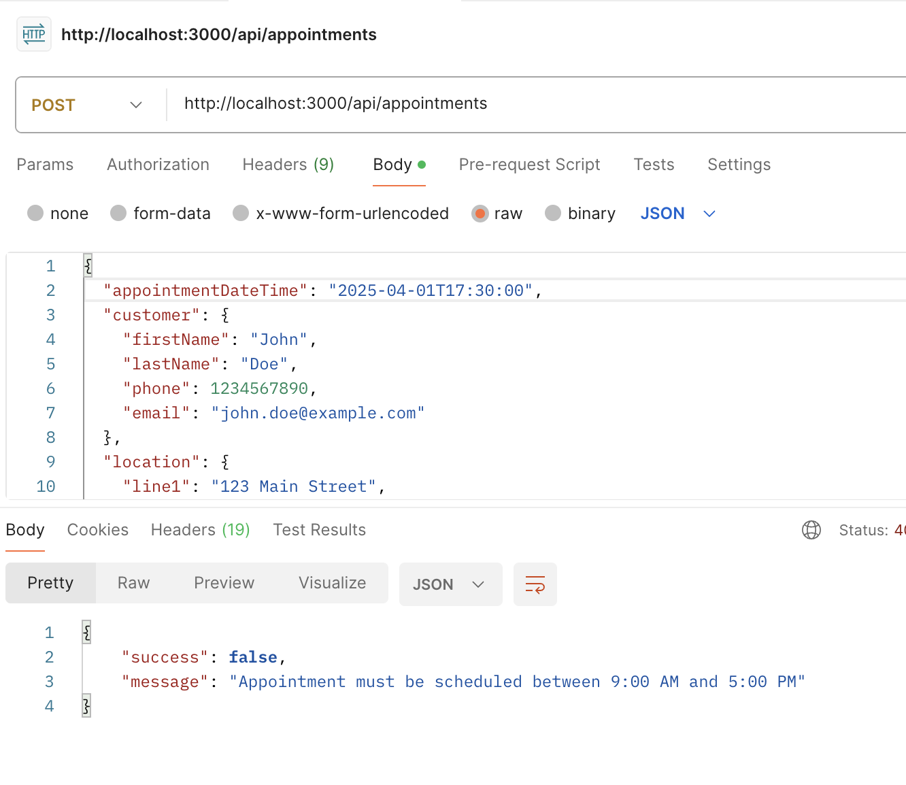

# Approach

I used Claude to generate the boilerplate for the Express server, along with the routes. I think modified the validation logic to make it cleaner and more performant.

# Examples

## Successful Booking

## Conflict between appointments

## Business hours enforced

